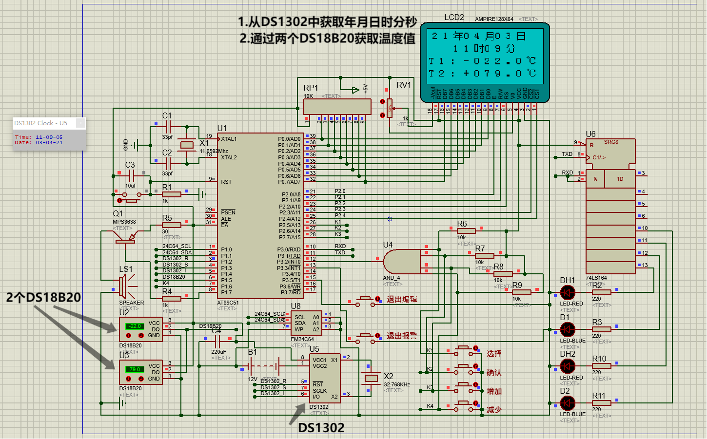
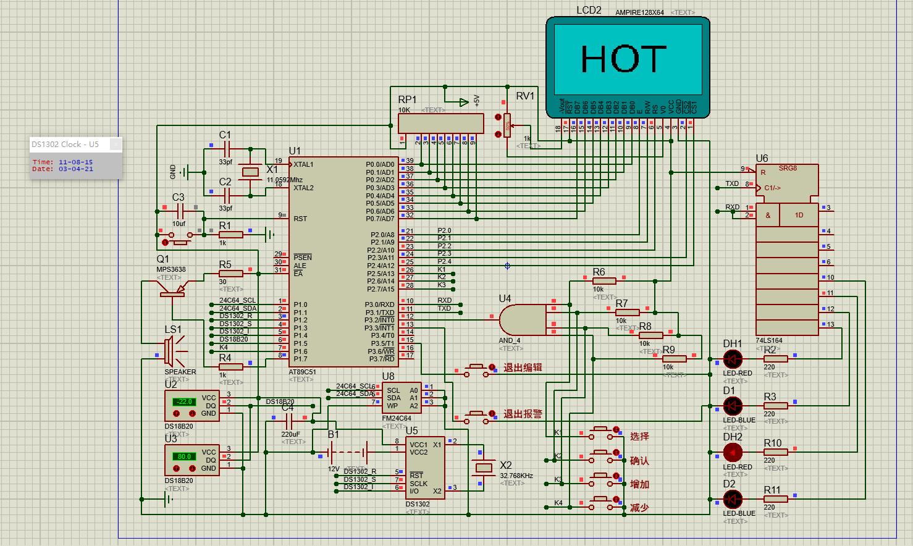
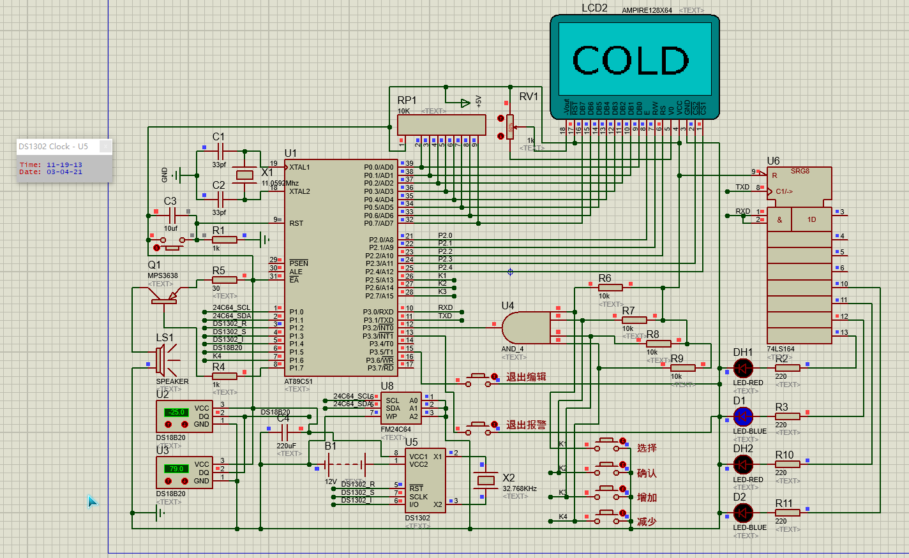
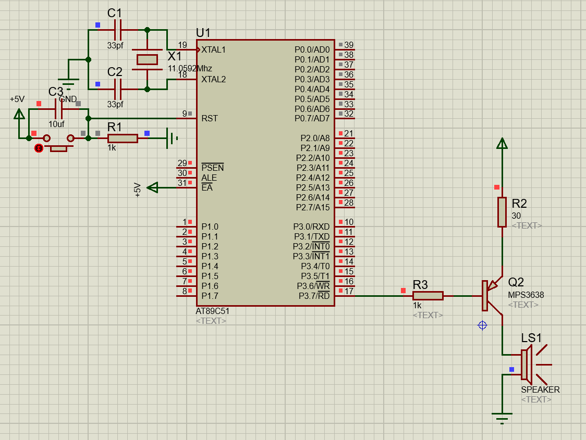
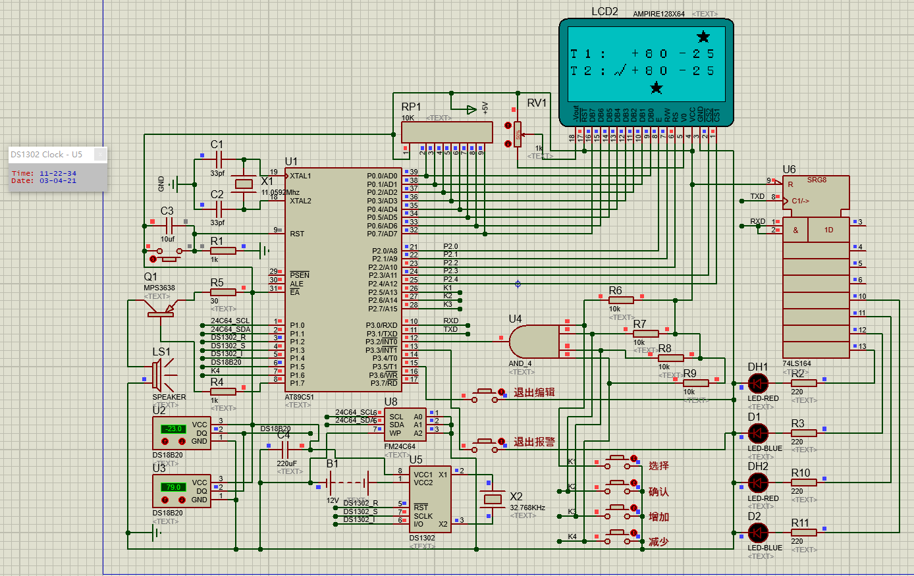

# Temperature
大学时的单片机汇编作品，项目地址<https://github.com/jan-bar/Temperature>

该项目需要**protues**运行，下面是可用的下载地址  
链接：https://pan.baidu.com/s/13gSiLTenkSV3a5niS3untQ  
提取码：7x48  

安装破解汉化方法如下：
```
1、下载解压，得到proteus pro 8.9 sp0原程序、patch破解文件和汉化补丁；
2、首先双击文件"P8.9.sp0.exe"安装软件，接受协议后，选择"Use a locally installed license key"；
3、在许可证安装界面，浏览指定patch破解文件夹中的Licence.lxk许可证文件，点击install安装许可证
4、再选择软件的安装目录，按默认路径安装即可；
5、成功安装，先不要运行，点击close；
5、再以右键管理员身份运行PP8.9.exe破解文件，注意：补丁工具无窗口的，运行一次即可。
6、至此，软件成功破解，但还不是中文；
7、这时将软件包中的汉化补丁复制到软件安装目录下替换；
默认目录【C:\Program Files (x86)\Labcenter Electronics\Proteus 8 Professional\Translations】
8、至此，软件成功汉化，以上就是proteus pro 8.9 sp0汉化破解版的详细安装教程，希望对用户有帮助。
```

然后直接用proteus打开`温度监控显示.DSN`文件，点击左下角的运行按钮即可  
该项目已经用`Keil`编译好了，多年没使用`Keil`如果有需要修改自己编译一下吧。  

源码全部使用汇编，相关源码文件描述如下：  
```
main.a51           主程序
DS1302.a51         驱动ds1302的程序
DS18B20.a51        驱动ds18b20的程序
AMPIRE128X64.a51   驱动128*64的显示屏，这个显示屏需要用取模软件，自行百度吧，我已经忘记咋搞了。
FM24C64.a51        当时由于51单片机引脚不够，做了一个扩展，用于驱动高低温时的LED灯
```

功能描述：  
1. 通过128*64的显示屏显示年月日时分秒，以及显示2个温度传感器的温度值。
2. 默认`T1`和`T2`的温度传感器告警上下限为`+80` ~ `-25`℃，当鼠标点击DS18B20的`+`和`-`时可以加减温度触发告警。
3. 温度超过限制时显示屏会显示对应字样，LED灯会亮，并且高温和低温会播放不同音乐。此时需要点击退出报警才会恢复。
4. 播放的音乐使用蜂鸣器，目前只录入了`欢乐颂`，`千年等一回`，`摇篮曲`这三首乐曲，有单独播放的示例代码。







**播放音乐的电路图**



4. 还可以设置两个温度设备的高低温限制，点击选择时会在T1和T2之间进行选择。
5. 点击确认时再点选择就会在高温和低温限制切换，此时点确认然后就可以点增加和减少了。
6. 将高温低温限制设置好了以后，可以点击退出编辑，则显示正常界面。



## 结语
> 这个项目是翻以前的文件翻出来的，当时也觉得写的不错。但毕业后没有从事硬件或嵌入式相关工作。现在渐渐淡忘了，连源码都有些看不懂了。
> 但是最近下载proteus居然还能运行，幸好当年把使用`Keil`编译后的文件也一并保存了。现在就把这个项目挂起来，当做纪念吧。
